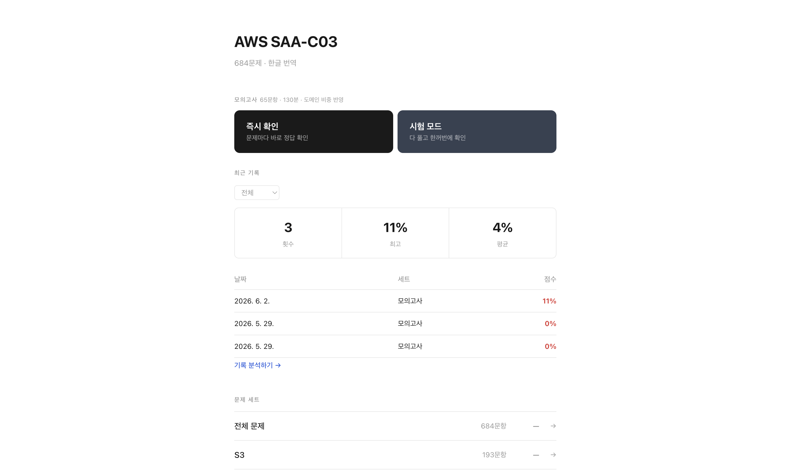
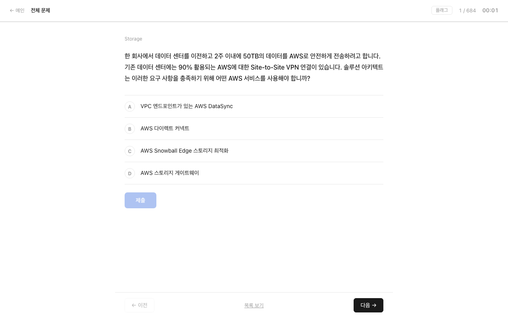
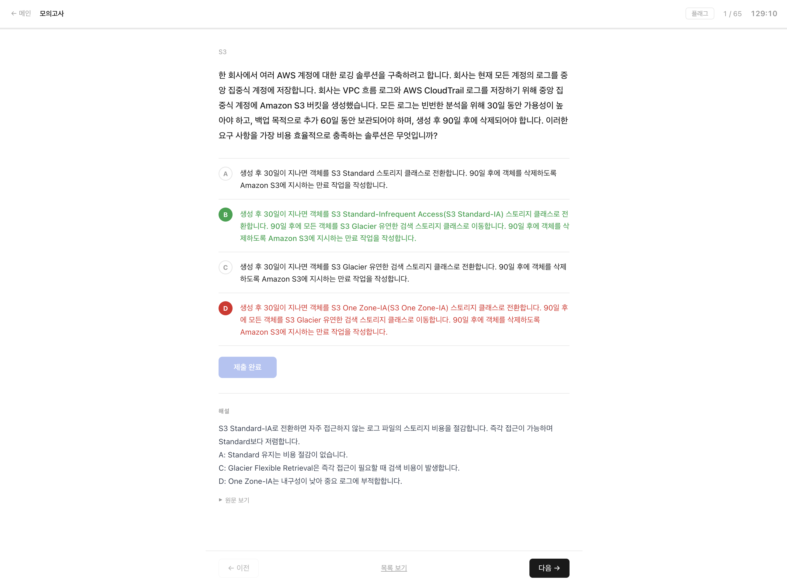

# ☁️ AWS SAA-C03 Study Notes

본 프로젝트는 AWS Certified Solutions Architect - Associate (SAA-C03) 자격증을 준비하는 과정을 기록하고,
학습한 개념을 나만의 언어로 정리한 저장소입니다.

단순 암기보다는 **"왜 이게 필요한지"** 를 이해하는 방식으로 공부하며,
실무에서 어떻게 쓰이는지 예시와 함께 정리했습니다.

Gemini 와 [gagaeun님의 AWS SAA TIL 블로그](https://velog.io/@gagaeun/series/AWS-SAA-TIL) 블로그를 참고하여 개념을 학습하고 정리했습니다.

---

## 📝 개념 정리

| # | 주제 |
|---|------|
| 01 | [IAM](concepts/01.%20IAM.md) |
| 02 | [EC2](concepts/02.%20EC2.md) |
| 03 | [EC2 - Associate](concepts/03.%20EC2%20-%20Associate.md) |
| 04 | [EC2 Instance Storage Section](concepts/04.%20EC2%20Instance%20Storage%20Section.md) |
| 05 | [Scalability & High Availability: Load Balancing & Auto Scaling Groups](concepts/05.%20Scalability%20%26%20High%20Availability%3A%20Load%20Balancing%20%26%20Auto%20Scaling%20Groups.md) |
| 06 | [RDS, Aurora, & ElasticCache](concepts/06.%20RDS%2C%20Aurora%2C%20%26%20ElasticCache.md) |
| 07 | [Route 53](concepts/07.%20Route%2053.md) |
| 08 | [Amazon S3](concepts/08.%20Amazon%20S3.md) |
| 09 | [Advanced S3](concepts/09.%20Advanced%20S3.md) |
| 10 | [Amazon S3 Security](concepts/10.%20Amazon%20S3%20Security.md) |
| 11 | [Global Infrastructure](concepts/11.%20Global%20Infrastructure.md) |
| 12 | [Advanced Storage on AWS](concepts/12.%20Advanced%20Storage%20on%20AWS.md) |
| 13 | [Integration & Messaging: SQS, SNS, Kinesis, Active MQ](concepts/13.%20Integration%20%26%20Messaging%3A%20SQS%2C%20SNS%2C%20Kinesis%2C%20Active%20MQ.md) |
| 14 | [Container: ECS, Fargate, ECR, EKS](concepts/14.%20Container%3A%20ECS%2C%20Fargate%2C%20ECR%2C%20EKS.md) |
| 15 | [Serverless](concepts/15.%20Serverless.md) |
| 16 | [Serverless Architectures](concepts/16.%20Serverless%20Architectures.md) |
| 17 | [Databases](concepts/17.%20Databases.md) |
| 18 | [Data & Analytics](concepts/18.%20Data%20%26%20Analytics.md) |
| 19 | [Machine Learning](concepts/19.%20Machine%20Learning.md) |
| 20 | [Monitoring, Audit and Performance: CloudWatch, CloudTrail & AWS Config](concepts/20.%20Monitoring%2C%20Audit%20and%20Performance%3A%20CloudWatch%2C%20CloudTrail%20%26%20AWS%20Config.md) |
| 21 | [Advanced Identity in AWS](concepts/21.%20Advanced%20Identity%20in%20AWS.md) |
| 22 | [AWS Security & Encryption: KMS, Encryption SDK, SSM Parameter Store](concepts/22.%20AWS%20Security%20%26%20Encryption%3A%20KMS%2C%20Encryption%20SDK%2C%20SSM%20Parameter%20Store.md) |
| 23 | [Virtual Private Cloud (VPC)](concepts/23.%20Virtual%20Private%20Cloud%20%28VPC%29.md) |
| 24 | [Disaster Recovery & Migrations](concepts/24.%20Disaster%20Recovery%20%26%20Migrations.md) |
| 25 | [Other AWS Services](concepts/25.%20Other%20AWS%20Services.md) |

### PDF 변환

`concepts/` 폴더의 개념 정리 파일을 PDF로 변환할 수 있습니다.

**사전 준비**

```bash
npm install -g md-to-pdf
```

**실행**

```bash
cd concepts
./convert_to_pdf.sh           # 전체 통합 PDF 1개 (기본값)
./convert_to_pdf.sh --merge   # 전체 통합 PDF 1개 (명시적)
./convert_to_pdf.sh --all     # 파일별 개별 PDF → pdf/ 폴더에 저장
```

- 통합 PDF 출력: `concepts/aws-saa-concepts.pdf`
- 개별 PDF 출력: `concepts/pdf/`
- 원본 `.md` 파일은 수정되지 않습니다

---

## 🖥️ 한글 모의고사 시뮬레이터







기출 684문제를 한글로 번역하여 로컬에서 풀어볼 수 있는 웹 시뮬레이터입니다.

### 주요 기능

- **즉시 확인 모드** — 문제마다 제출 후 바로 정답 및 해설 확인
- **시험 모드** — 65문제를 다 풀고 나서 전체 정답·해설 한꺼번에 확인
- **모의고사** — 65문항, 130분, 실제 시험 도메인 비중 반영 (Secure 30% / Resilient 26% / High-Performing 24% / Cost 20%)
- **토픽별 연습** — 15개 토픽(S3, EC2, RDS, VPC 등)으로 분류된 문제 세트
- **오답 복습** — 틀린 문제를 자동 추적하여 집중 복습
- **기록 분석** — 회차별 점수, 도메인별 정답률, 자주 틀린 문제 TOP 10
- **기록 내보내기/불러오기** — JSON 파일로 학습 기록 백업 및 복원

### 사전 준비

- Python 3.10 이상
- Git

### 설치 및 실행

**1. Python 가상환경 생성 및 패키지 설치**

```bash
python3 -m venv .venv
.venv/bin/pip install PyMuPDF deep-translator
```

> Windows: `.venv/bin/pip` → `.venv\Scripts\pip`

**2. 빌드 + 서버 실행**

```bash
bash start.sh
```

브라우저에서 **http://localhost:8080** 접속

> **첫 빌드 소요 시간**: 약 25~35분 (Google Translate 무료 API, 10문제마다 체크포인트 저장 → 중단해도 이어서 진행)

### 정답/해설 수정 (answer_overrides.json)

파싱 오류나 오답이 있는 문제는 `answer_overrides.json`에서 직접 수정할 수 있습니다.

```json
{
  "1": {
    "answer": "AB",
    "explanation": "정답 이유 설명..."
  }
}
```

- `answer`: 정답 알파벳 (복수 정답은 `"AB"`, `"BCE"` 형식)
- `explanation`: 한글 해설 (작성 시 번역 없이 바로 적용)
- 빌드 시 TXT 파싱 결과보다 이 파일이 우선 적용됩니다

### 커스텀 문제 업로드

앱 하단 **"문제 업로드"** 버튼으로 직접 만든 JSON 문제를 불러올 수 있습니다. 최소 필드: `id`, `question`, `options`, `answer`

```json
{
  "questions": [
    {
      "id": 1,
      "question": "A company wants to...",
      "question_ko": "한 회사가 원합니다...",
      "options": { "A": "...", "B": "...", "C": "...", "D": "..." },
      "options_ko": { "A": "...", "B": "...", "C": "...", "D": "..." },
      "answer": "A",
      "explanation_ko": "해설...",
      "multi_answer": false
    }
  ]
}
```

> `questions.json`, `aws-saa-c03.pdf`, `aws-saa-solution.txt`는 저작권 문제로 저장소에 포함되어 있지 않습니다. `start.sh` 실행 시 자동으로 다운로드·생성됩니다.

### 출처

- 문제: [AWS SAA-C03 Exam Dump (GitHub)](https://github.com/Iamrushabhshahh/AWS-Certified-Solutions-Architect-Associate-SAA-C03-Exam-Dump-With-Solution)
- 번역: [deep-translator](https://github.com/nidhaloff/deep-translator) (Google Translate 무료 API)

### ⚠️ 주의사항

- 본 프로젝트는 **개인 학습 목적**으로만 제작되었습니다.
- 시험 문제의 저작권은 AWS 및 원 출처에 있으며, 상업적 이용 시 문제가 될 수 있습니다.
- Google Translate 무료 API는 상업적 사용이 허용되지 않습니다.
- **공개 서비스 배포는 저작권 및 API 이용약관 위반의 소지가 있으니 개인 로컬 환경에서만 사용하세요.**
